# Code Map and Flow

Tài liệu này giải thích từng khối code làm gì và dữ liệu đi qua hệ thống như thế nào. Mục tiêu là đọc xong có thể tự lần ra luồng của dự án.

## 1. Bản đồ code theo layer

### Frontend entry layer

- [smart-food-tour/src/main.jsx](smart-food-tour/src/main.jsx) khởi động React app và gắn `App` vào DOM.
- [smart-food-tour/src/App.jsx](smart-food-tour/src/App.jsx) cấu hình router, React Query provider, Tooltip provider và toaster.
- [smart-food-tour/src/index.css](smart-food-tour/src/index.css) khai báo theme, font, màu nền, marker map và style global.

### State layer

- [smart-food-tour/src/store/use-app-store.js](smart-food-tour/src/store/use-app-store.js) là Zustand store trung tâm cho language, gpsPosition, playedVenues và auth.
- Store chỉ persist `language`, còn token/user lấy từ localStorage khi khởi tạo để phục vụ dashboard.

### API layer

- [smart-food-tour/src/lib/api.js](smart-food-tour/src/lib/api.js) là API client chính.
- File này tự gắn JWT, unwrap response kiểu `{ success, data }`, và định nghĩa toàn bộ hook React Query cho venue, auth, vendor, admin và payment.
- [smart-food-tour/src/lib/tts.js](smart-food-tour/src/lib/tts.js) quản lý phát audio stream, dừng audio, unlock autoplay và fallback Web Speech API.

### UI components

- [smart-food-tour/src/components/chat-box.jsx](smart-food-tour/src/components/chat-box.jsx) là chat AI nổi trên màn hình.
- [smart-food-tour/src/components/language-switcher.jsx](smart-food-tour/src/components/language-switcher.jsx) là nút đổi ngôn ngữ về trang đầu.
- [smart-food-tour/src/components/ui/](smart-food-tour/src/components/ui/) chứa bộ component UI tái sử dụng.

### Pages

- [smart-food-tour/src/pages/language-select.jsx](smart-food-tour/src/pages/language-select.jsx) là màn chọn ngôn ngữ đầu vào.
- [smart-food-tour/src/pages/map-page.jsx](smart-food-tour/src/pages/map-page.jsx) là bản đồ trung tâm của trải nghiệm guest.
- [smart-food-tour/src/pages/venue-detail.jsx](smart-food-tour/src/pages/venue-detail.jsx) là màn chi tiết quán.
- [smart-food-tour/src/pages/auth-page.jsx](smart-food-tour/src/pages/auth-page.jsx) xử lý login và vendor registration.
- [smart-food-tour/src/pages/vendor-dashboard.jsx](smart-food-tour/src/pages/vendor-dashboard.jsx) quản lý quán, thống kê và luồng đăng ký quán mới.
- [smart-food-tour/src/pages/admin-dashboard.jsx](smart-food-tour/src/pages/admin-dashboard.jsx) duyệt POI, quản lý user và xem báo cáo.
- [smart-food-tour/src/pages/payment-page.jsx](smart-food-tour/src/pages/payment-page.jsx), [smart-food-tour/src/pages/payment-success.jsx](smart-food-tour/src/pages/payment-success.jsx), [smart-food-tour/src/pages/payment-failed.jsx](smart-food-tour/src/pages/payment-failed.jsx) bao quanh luồng thanh toán.

### Backend bootstrap

- [api-server/src/index.js](api-server/src/index.js) connect DB rồi start server.
- [api-server/src/app.js](api-server/src/app.js) cấu hình middleware và mount router dưới `/api`.
- [api-server/src/routes/index.js](api-server/src/routes/index.js) gom toàn bộ route nhỏ thành một router tổng.

### Backend domain layer

- [api-server/src/models/user.model.js](api-server/src/models/user.model.js) quản lý user, role, status và password hash.
- [api-server/src/models/poi.model.js](api-server/src/models/poi.model.js) là schema trung tâm của quán/điểm đến.
- [api-server/src/models/payment.model.js](api-server/src/models/payment.model.js) lưu lịch sử giao dịch VNPay.
- [api-server/src/models/audioStat.model.js](api-server/src/models/audioStat.model.js) lưu thống kê audio.

### Backend route layer

- [api-server/src/routes/venues.js](api-server/src/routes/venues.js) phục vụ danh sách quán, chi tiết, respect, review, QR tap.
- [api-server/src/routes/audio.js](api-server/src/routes/audio.js) tạo và stream audio từ gTTS, có cache file và lock để tránh generate trùng.
- [api-server/src/routes/chat.js](api-server/src/routes/chat.js) gọi OpenRouter và fallback sang gợi ý quán cục bộ nếu AI lỗi.
- [api-server/src/routes/auth.js](api-server/src/routes/auth.js) xử lý login, register, refresh, logout, vendor/admin stats và moderation summary.
- [api-server/src/routes/pois.js](api-server/src/routes/pois.js) xử lý tạo/sửa/xóa quán, dịch đa ngôn ngữ và approval workflow.
- [api-server/src/routes/payment.js](api-server/src/routes/payment.js) tạo VNPay order, verify return URL, IPN callback và query payment status.
- [api-server/src/routes/languages.js](api-server/src/routes/languages.js) trả 15 ngôn ngữ hỗ trợ.
- [api-server/src/routes/health.js](api-server/src/routes/health.js) dùng cho health check.

### Redis và xử lý concurrent audio

- Redis được dùng theo hướng optional ở backend để hỗ trợ lock phân tán cho audio generation.
- Cơ chế chính nằm trong [api-server/src/routes/audio.js](api-server/src/routes/audio.js).

Chiến lược khi nhiều người cùng nghe một quán tại cùng thời điểm:

1. Tạo cache key theo `venueId + lang + textHash` để xác định đúng file audio cần sinh.
2. Kiểm tra file cache nếu đã tồn tại thì stream ngay, không generate lại.
3. Nếu chưa có cache, backend thử lấy Redis lock bằng `SET key token NX PX`.
4. Tiến trình lấy được lock sẽ là tiến trình duy nhất generate MP3.
5. Các tiến trình khác chờ trong khoảng timeout và poll xem file cache đã xuất hiện chưa.
6. Khi lock rơi hoặc tiến trình chính lỗi, tiến trình chờ có thể takeover lock và generate tiếp.
7. Lock được release an toàn bằng Lua script để tránh xóa lock của tiến trình khác.

Các biến cấu hình liên quan concurrent audio:

- `AUDIO_LOCK_TTL_MS`: thời gian sống lock.
- `AUDIO_WAIT_TIMEOUT_MS`: thời gian client request chờ file cache xuất hiện.
- `AUDIO_POLL_INTERVAL_MS`: tần suất poll cache/lock khi đang chờ.

Fallback khi không có Redis:

- Backend vẫn generate theo cơ chế file cache cục bộ.
- Có kiểm tra tồn tại file trước/sau generate để giảm khả năng tạo trùng.
- Dù vậy, mức bảo vệ race condition sẽ thấp hơn lock phân tán Redis.

## 2. Dữ liệu chạy qua hệ thống như thế nào

### 2.1 Guest discovery flow

1. User vào [smart-food-tour/src/pages/language-select.jsx](smart-food-tour/src/pages/language-select.jsx).
2. Chọn ngôn ngữ và chuyển sang [smart-food-tour/src/pages/map-page.jsx](smart-food-tour/src/pages/map-page.jsx).
3. Map page đọc `language` và `gpsPosition` từ [smart-food-tour/src/store/use-app-store.js](smart-food-tour/src/store/use-app-store.js).
4. Map page gọi `useNearbyVenues()` trong [smart-food-tour/src/lib/api.js](smart-food-tour/src/lib/api.js).
5. Backend [api-server/src/routes/venues.js](api-server/src/routes/venues.js) lọc POI approved, tính khoảng cách, trả danh sách gần nhất.
6. Khi venue nằm trong vùng audio, map page gọi [smart-food-tour/src/lib/tts.js](smart-food-tour/src/lib/tts.js) để phát audio từ [api-server/src/routes/audio.js](api-server/src/routes/audio.js).
7. Người dùng mở [smart-food-tour/src/pages/venue-detail.jsx](smart-food-tour/src/pages/venue-detail.jsx) để xem menu, review, respect và QR.

Quy tắc khi cùng lúc lọt vào phạm vi nhiều quán:

- `venues/nearby` được backend sort theo khoảng cách tăng dần.
- Frontend lấy quán đầu tiên trong danh sách `withinAudioRadius` chưa phát để trigger audio.
- Kết quả: quán gần nhất sẽ được ưu tiên phát trước.
- Nếu đang phát một quán, audio chỉ dừng khi ra khỏi `audioRadius` hoặc track hiện tại kết thúc.

### 2.2 Review and reaction flow

1. Frontend gửi review qua `useCreateVenueReview()`.
2. `api.js` tự gắn `x-guest-token` bằng localStorage token riêng cho khách.
3. Backend trong [api-server/src/routes/venues.js](api-server/src/routes/venues.js) kiểm tra rate limit, spam pattern và duplicate review.
4. Review hợp lệ sẽ được lưu vào POI và frontend invalidate cache để hiển thị lại.

Ghi chú: luồng review này không bắt buộc đăng nhập, người dùng ẩn danh vẫn gửi bình luận được qua `x-guest-token`.

QR scan để nghe audio:

- Mỗi POI có `landingUrl` và `landingQrImageUrl`.
- User quét QR sẽ vào landing của quán đó.
- Từ landing/venue detail, user có thể kích hoạt nghe audio guide của quán tương ứng.

### 2.3 Vendor onboarding flow

1. Vendor login tại [smart-food-tour/src/pages/auth-page.jsx](smart-food-tour/src/pages/auth-page.jsx).
2. Nếu vào luồng payment, [smart-food-tour/src/pages/payment-page.jsx](smart-food-tour/src/pages/payment-page.jsx) gọi `useCreatePayment()`.
3. Backend [api-server/src/routes/payment.js](api-server/src/routes/payment.js) tạo payment record và trả VNPay URL.
4. Sau khi thanh toán, VNPay redirect về return URL để update trạng thái payment.
5. Vendor quay lại dashboard và tạo POI mới qua [smart-food-tour/src/pages/vendor-dashboard.jsx](smart-food-tour/src/pages/vendor-dashboard.jsx).
6. Backend [api-server/src/routes/pois.js](api-server/src/routes/pois.js) gắn `status: pending` và lưu bản dịch đa ngôn ngữ.
7. Admin duyệt POI để nó xuất hiện trên map công khai.

### 2.4 Admin moderation flow

1. Admin vào [smart-food-tour/src/pages/admin-dashboard.jsx](smart-food-tour/src/pages/admin-dashboard.jsx).
2. UI gọi các hook từ [smart-food-tour/src/lib/api.js](smart-food-tour/src/lib/api.js) như `useAdminStats`, `useAdminPending`, `useAdminUsers`, `useAdminVenues`.
3. Backend trả thống kê, danh sách chờ duyệt và danh sách quán.
4. Admin approve/reject, backend cập nhật status trong [api-server/src/routes/pois.js](api-server/src/routes/pois.js) hoặc [api-server/src/routes/auth.js](api-server/src/routes/auth.js) tùy ngữ cảnh.

## 3. Sơ đồ tổng thể

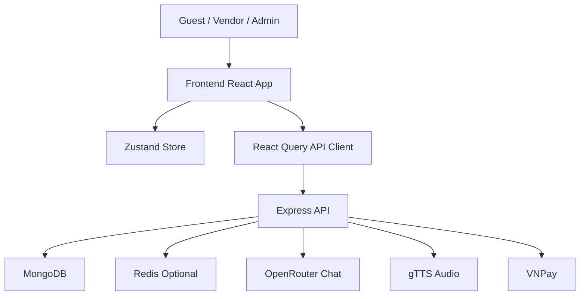

## 4. Guest flow

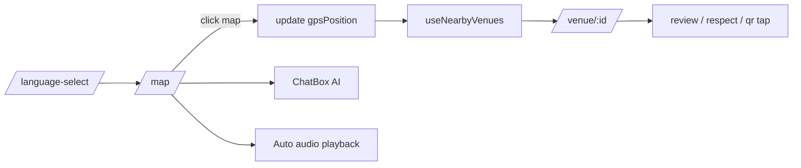

## 5. Vendor flow

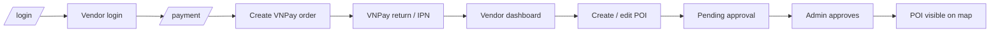

## 6. Audio flow

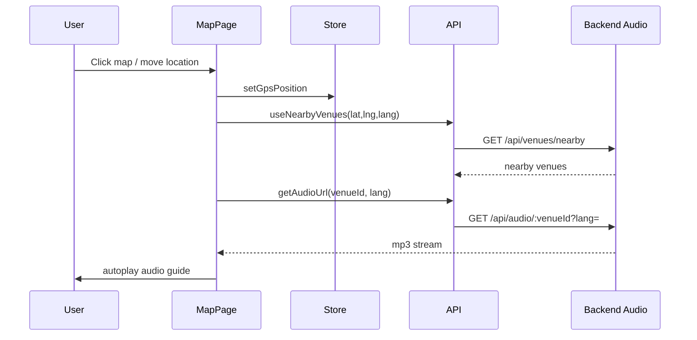

## 7. File trách nhiệm nhanh

- [smart-food-tour/src/pages/map-page.jsx](smart-food-tour/src/pages/map-page.jsx): bản đồ, sidebar, audio trigger, marker, chat entry.
- [smart-food-tour/src/pages/venue-detail.jsx](smart-food-tour/src/pages/venue-detail.jsx): hero, tabs, audio button, review, QR.
- [smart-food-tour/src/pages/vendor-dashboard.jsx](smart-food-tour/src/pages/vendor-dashboard.jsx): quản lý quán, thêm quán, thống kê vendor.
- [smart-food-tour/src/pages/admin-dashboard.jsx](smart-food-tour/src/pages/admin-dashboard.jsx): moderation, stats, users, reports.
- [api-server/src/routes/venues.js](api-server/src/routes/venues.js): mọi dữ liệu quán public và tương tác khách.
- [api-server/src/routes/pois.js](api-server/src/routes/pois.js): lifecycle của POI từ tạo tới duyệt/xóa.
- [api-server/src/routes/payment.js](api-server/src/routes/payment.js): order, return, IPN, status.
- [api-server/src/routes/audio.js](api-server/src/routes/audio.js): text-to-speech stream và cache.
- [api-server/src/routes/chat.js](api-server/src/routes/chat.js): AI assistant và fallback.

## 8. Sơ đồ tuần tự chi tiết theo chức năng

Phần này ghi rõ function/route nào thực hiện từng bước để bạn lần theo luồng nhanh hơn khi debug hoặc chỉnh logic.

Bản tách riêng để dễ đọc: [SEQUENCE_DIAGRAMS.md](SEQUENCE_DIAGRAMS.md)

### 8.1 Chọn ngôn ngữ rồi vào bản đồ

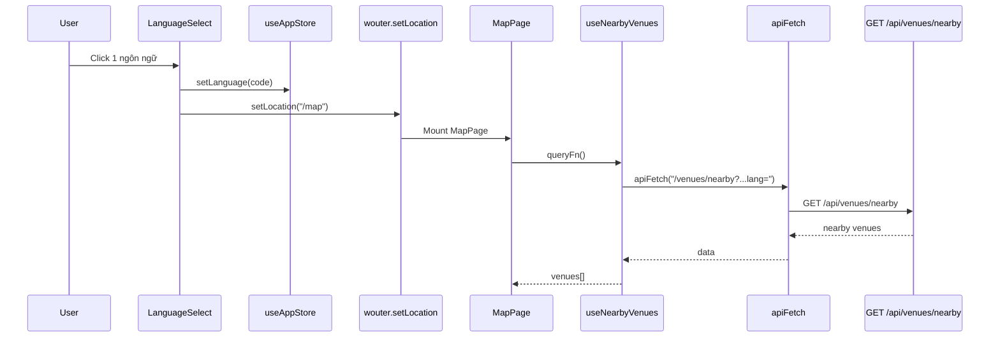

Chú thích function:
- Frontend: `LanguageSelect.handleSelect`, `useAppStore.setLanguage`, `useNearbyVenues`.
- Backend: `router.get("/venues/nearby")`, `localize()`, `haversine()`.

### 8.2 Bản đồ, chọn vị trí và phát audio tự động

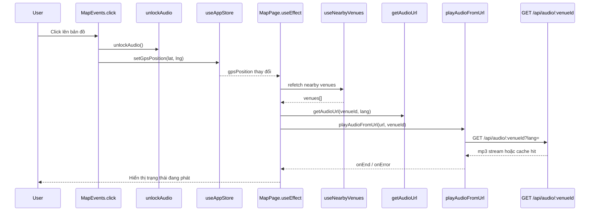

Chú thích function:
- Frontend: `MapEvents.onLocationClick`, `MapPage` proximity `useEffect`, `handleStopAudio`, `markVenuePlayed`, `unlockAudio`, `stopAudioTranscript`.
- Backend: `router.get("/:venueId")` trong `api-server/src/routes/audio.js`, `getTextAndLang()`, `acquireAudioLock()`, `waitForAudioCacheOrTakeover()`, `generateAudioFileWithRetry()`, `serveAudioFile()`.

### 8.3 Xem chi tiết quán, nghe audio, yêu thích, quét QR và gửi review

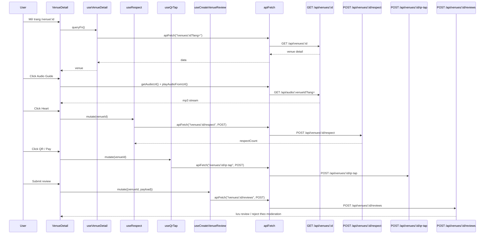

Chú thích function:
- Frontend: `VenueDetail.handlePlayAudio`, `handleRespect`, `handleQrTap`, `handleSubmitReview`.
- Hook: `useVenueDetail`, `useRespect`, `useQrTap`, `useCreateVenueReview`.
- Backend: `router.get("/venues/:id")`, `router.post("/venues/:id/respect")`, `router.post("/venues/:id/qr-tap")`, `router.post("/venues/:id/reviews")`, `moderateReviewContent()`, `enforceRateLimit()`, `markReviewOnce()`.

### 8.4 Chat AI gợi ý quán

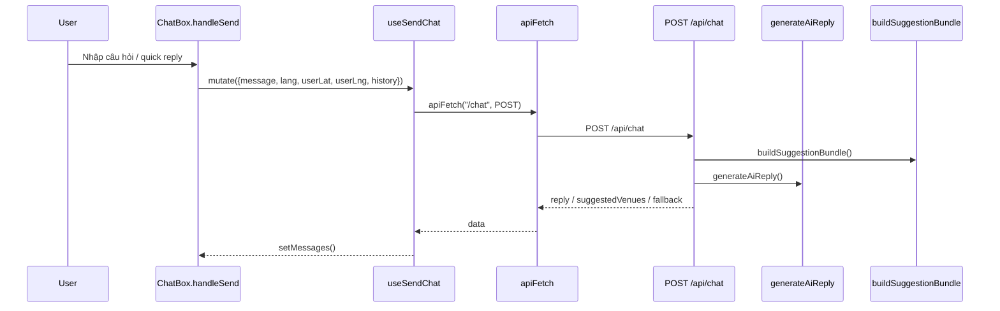

Chú thích function:
- Frontend: `ChatBox.handleSend`, `useSendChat`.
- Backend: `router.post("/chat")`, `generateAiReply()`, `buildSuggestionBundle()`, `toChatHistory()`, `formatVenueContext()`.

### 8.5 Đăng nhập, đăng ký vendor và phân luồng dashboard

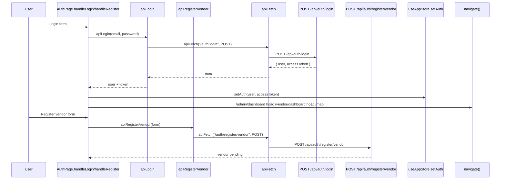

Chú thích function:
- Frontend: `AuthPage.handleLogin`, `AuthPage.handleRegister`.
- Backend: `router.post("/auth/login")`, `router.post("/auth/register/vendor")`, `signTokens()`, `requireAuth()` cho các route dashboard.

### 8.6 Thanh toán VNPay và tạo quán sau thanh toán

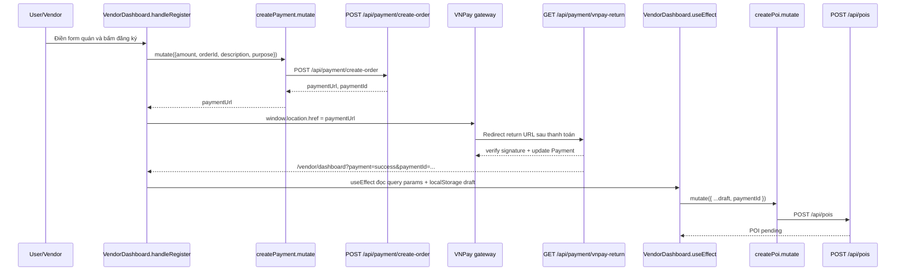

Chú thích function:
- Frontend thanh toán riêng: `PaymentPage.handleCreatePayment` + `useCreatePayment`.
- Frontend vendor dashboard: `VendorDashboard.handleRegister`, effect đọc query `payment=success`, `PENDING_POI_DRAFT_KEY`.
- Backend payment: `router.post("/payment/create-order")`, `router.get("/payment/vnpay-return")`, `router.post("/payment/vnpay-ipn")`, `router.get("/payment/status/:paymentId")`.
- Backend POI: `router.post("/pois")` kiểm tra `paymentId`, tạo `Poi` trạng thái `pending`, rồi gắn `landingUrl` và `landingQrImageUrl`.

### 8.7 Admin duyệt quán và quản lý user

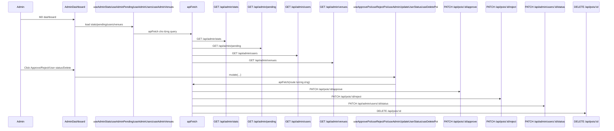

Chú thích function:
- Frontend: `AdminDashboard.handleApprove`, `handleReject`, `handleUserStatus`, `handleDeleteVenue`, `handleLogout`.
- Hook: `useAdminStats`, `useAdminPending`, `useAdminUsers`, `useAdminVenues`, `useApprovePoi`, `useRejectPoi`, `useAdminUpdateUserStatus`, `useDeletePoi`.
- Backend: `router.get("/admin/stats")`, `router.get("/admin/pending")`, `router.patch("/admin/pending/:id")`, `router.patch("/admin/users/:id/status")`, `router.get("/admin/users")`, `router.get("/admin/venues")`.

### 8.8 Bảng tra nhanh function theo chức năng

- Chọn ngôn ngữ: `LanguageSelect.handleSelect`, `useAppStore.setLanguage`.
- Khám phá quán gần: `MapPage` proximity `useEffect`, `useNearbyVenues`, `router.get("/venues/nearby")`.
- Phát audio: `MapPage` + `playAudioFromUrl`, `router.get("/:venueId")` trong `audio.js`.
- Chi tiết quán: `VenueDetail.handlePlayAudio`, `handleRespect`, `handleQrTap`, `handleSubmitReview`.
- Chat AI: `ChatBox.handleSend`, `useSendChat`, `router.post("/chat")`.
- Đăng nhập/đăng ký: `AuthPage.handleLogin`, `AuthPage.handleRegister`, `router.post("/auth/login")`, `router.post("/auth/register/vendor")`.
- Thanh toán: `VendorDashboard.handleRegister`, `PaymentPage.handleCreatePayment`, `router.post("/payment/create-order")`.
- Tạo quán sau payment: effect trong `VendorDashboard`, `router.post("/pois")`.
- Duyệt quán: `AdminDashboard.handleApprove`, `handleReject`, `handleUserStatus`, `handleDeleteVenue`.
