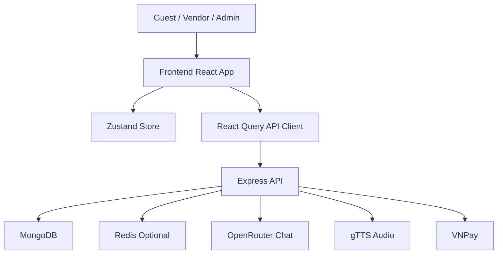
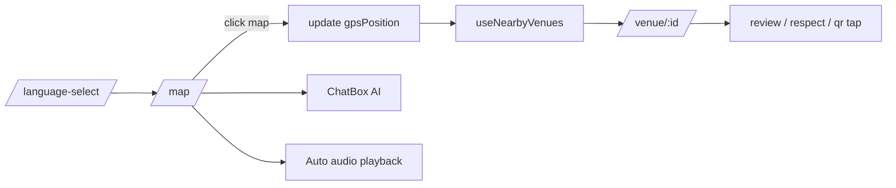
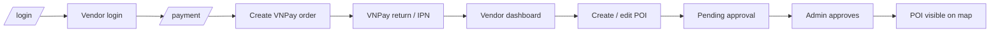
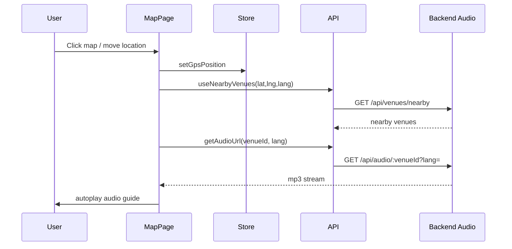

# Code Map and Flow

Tài liệu này giải thích từng khối code làm gì và dữ liệu đi qua hệ thống như thế nào. Mục tiêu là đọc xong có thể tự lần ra luồng của dự án.

## 1. Bản đồ code theo layer

### Frontend entry layer

- [smart-food-tour/src/main.jsx](smart-food-tour/src/main.jsx) khởi động React app và gắn `App` vào DOM.
- [smart-food-tour/src/App.jsx](smart-food-tour/src/App.jsx) cấu hình router, React Query provider, Tooltip provider và toaster.
- [smart-food-tour/src/index.css](smart-food-tour/src/index.css) khai báo theme, font, màu nền, marker map và style global.

### State layer

- [smart-food-tour/src/store/use-app-store.js](smart-food-tour/src/store/use-app-store.js) là Zustand store trung tâm cho language, gpsPosition, playedVenues và auth.
- Store chỉ persist `language`, còn token/user lấy từ localStorage khi khởi tạo để phục vụ dashboard.

### API layer

- [smart-food-tour/src/lib/api.js](smart-food-tour/src/lib/api.js) là API client chính.
- File này tự gắn JWT, unwrap response kiểu `{ success, data }`, và định nghĩa toàn bộ hook React Query cho venue, auth, vendor, admin và payment.
- [smart-food-tour/src/lib/tts.js](smart-food-tour/src/lib/tts.js) quản lý phát audio stream, dừng audio, unlock autoplay và fallback Web Speech API.

### UI components

- [smart-food-tour/src/components/chat-box.jsx](smart-food-tour/src/components/chat-box.jsx) là chat AI nổi trên màn hình.
- [smart-food-tour/src/components/language-switcher.jsx](smart-food-tour/src/components/language-switcher.jsx) là nút đổi ngôn ngữ về trang đầu.
- [smart-food-tour/src/components/ui/](smart-food-tour/src/components/ui/) chứa bộ component UI tái sử dụng.

### Pages

- [smart-food-tour/src/pages/language-select.jsx](smart-food-tour/src/pages/language-select.jsx) là màn chọn ngôn ngữ đầu vào.
- [smart-food-tour/src/pages/map-page.jsx](smart-food-tour/src/pages/map-page.jsx) là bản đồ trung tâm của trải nghiệm guest.
- [smart-food-tour/src/pages/venue-detail.jsx](smart-food-tour/src/pages/venue-detail.jsx) là màn chi tiết quán.
- [smart-food-tour/src/pages/auth-page.jsx](smart-food-tour/src/pages/auth-page.jsx) xử lý login và vendor registration.
- [smart-food-tour/src/pages/vendor-dashboard.jsx](smart-food-tour/src/pages/vendor-dashboard.jsx) quản lý quán, thống kê và luồng đăng ký quán mới.
- [smart-food-tour/src/pages/admin-dashboard.jsx](smart-food-tour/src/pages/admin-dashboard.jsx) duyệt POI, quản lý user và xem báo cáo.
- [smart-food-tour/src/pages/payment-page.jsx](smart-food-tour/src/pages/payment-page.jsx), [smart-food-tour/src/pages/payment-success.jsx](smart-food-tour/src/pages/payment-success.jsx), [smart-food-tour/src/pages/payment-failed.jsx](smart-food-tour/src/pages/payment-failed.jsx) bao quanh luồng thanh toán.

### Backend bootstrap

- [api-server/src/index.js](api-server/src/index.js) connect DB rồi start server.
- [api-server/src/app.js](api-server/src/app.js) cấu hình middleware và mount router dưới `/api`.
- [api-server/src/routes/index.js](api-server/src/routes/index.js) gom toàn bộ route nhỏ thành một router tổng.

### Backend domain layer

- [api-server/src/models/user.model.js](api-server/src/models/user.model.js) quản lý user, role, status và password hash.
- [api-server/src/models/poi.model.js](api-server/src/models/poi.model.js) là schema trung tâm của quán/điểm đến.
- [api-server/src/models/payment.model.js](api-server/src/models/payment.model.js) lưu lịch sử giao dịch VNPay.
- [api-server/src/models/audioStat.model.js](api-server/src/models/audioStat.model.js) lưu thống kê audio.

### Backend route layer

- [api-server/src/routes/venues.js](api-server/src/routes/venues.js) phục vụ danh sách quán, chi tiết, respect, review, QR tap.
- [api-server/src/routes/audio.js](api-server/src/routes/audio.js) tạo và stream audio từ gTTS, có cache file và lock để tránh generate trùng.
- [api-server/src/routes/chat.js](api-server/src/routes/chat.js) gọi OpenRouter và fallback sang gợi ý quán cục bộ nếu AI lỗi.
- [api-server/src/routes/auth.js](api-server/src/routes/auth.js) xử lý login, register, refresh, logout, vendor/admin stats và moderation summary.
- [api-server/src/routes/pois.js](api-server/src/routes/pois.js) xử lý tạo/sửa/xóa quán, dịch đa ngôn ngữ và approval workflow.
- [api-server/src/routes/payment.js](api-server/src/routes/payment.js) tạo VNPay order, verify return URL, IPN callback và query payment status.
- [api-server/src/routes/languages.js](api-server/src/routes/languages.js) trả 15 ngôn ngữ hỗ trợ.
- [api-server/src/routes/health.js](api-server/src/routes/health.js) dùng cho health check.

## 2. Dữ liệu chạy qua hệ thống như thế nào

### 2.1 Guest discovery flow

1. User vào [smart-food-tour/src/pages/language-select.jsx](smart-food-tour/src/pages/language-select.jsx).
2. Chọn ngôn ngữ và chuyển sang [smart-food-tour/src/pages/map-page.jsx](smart-food-tour/src/pages/map-page.jsx).
3. Map page đọc `language` và `gpsPosition` từ [smart-food-tour/src/store/use-app-store.js](smart-food-tour/src/store/use-app-store.js).
4. Map page gọi `useNearbyVenues()` trong [smart-food-tour/src/lib/api.js](smart-food-tour/src/lib/api.js).
5. Backend [api-server/src/routes/venues.js](api-server/src/routes/venues.js) lọc POI approved, tính khoảng cách, trả danh sách gần nhất.
6. Khi venue nằm trong vùng audio, map page gọi [smart-food-tour/src/lib/tts.js](smart-food-tour/src/lib/tts.js) để phát audio từ [api-server/src/routes/audio.js](api-server/src/routes/audio.js).
7. Người dùng mở [smart-food-tour/src/pages/venue-detail.jsx](smart-food-tour/src/pages/venue-detail.jsx) để xem menu, review, respect và QR.

### 2.2 Review and reaction flow

1. Frontend gửi review qua `useCreateVenueReview()`.
2. `api.js` tự gắn `x-guest-token` bằng localStorage token riêng cho khách.
3. Backend trong [api-server/src/routes/venues.js](api-server/src/routes/venues.js) kiểm tra rate limit, spam pattern và duplicate review.
4. Review hợp lệ sẽ được lưu vào POI và frontend invalidate cache để hiển thị lại.

### 2.3 Vendor onboarding flow

1. Vendor login tại [smart-food-tour/src/pages/auth-page.jsx](smart-food-tour/src/pages/auth-page.jsx).
2. Nếu vào luồng payment, [smart-food-tour/src/pages/payment-page.jsx](smart-food-tour/src/pages/payment-page.jsx) gọi `useCreatePayment()`.
3. Backend [api-server/src/routes/payment.js](api-server/src/routes/payment.js) tạo payment record và trả VNPay URL.
4. Sau khi thanh toán, VNPay redirect về return URL để update trạng thái payment.
5. Vendor quay lại dashboard và tạo POI mới qua [smart-food-tour/src/pages/vendor-dashboard.jsx](smart-food-tour/src/pages/vendor-dashboard.jsx).
6. Backend [api-server/src/routes/pois.js](api-server/src/routes/pois.js) gắn `status: pending` và lưu bản dịch đa ngôn ngữ.
7. Admin duyệt POI để nó xuất hiện trên map công khai.

### 2.4 Admin moderation flow

1. Admin vào [smart-food-tour/src/pages/admin-dashboard.jsx](smart-food-tour/src/pages/admin-dashboard.jsx).
2. UI gọi các hook từ [smart-food-tour/src/lib/api.js](smart-food-tour/src/lib/api.js) như `useAdminStats`, `useAdminPending`, `useAdminUsers`, `useAdminVenues`.
3. Backend trả thống kê, danh sách chờ duyệt và danh sách quán.
4. Admin approve/reject, backend cập nhật status trong [api-server/src/routes/pois.js](api-server/src/routes/pois.js) hoặc [api-server/src/routes/auth.js](api-server/src/routes/auth.js) tùy ngữ cảnh.

## 3. Sơ đồ tổng thể

## 4. Guest flow

## 5. Vendor flow

## 6. Audio flow

## 7. File trách nhiệm nhanh

- [smart-food-tour/src/pages/map-page.jsx](smart-food-tour/src/pages/map-page.jsx): bản đồ, sidebar, audio trigger, marker, chat entry.
- [smart-food-tour/src/pages/venue-detail.jsx](smart-food-tour/src/pages/venue-detail.jsx): hero, tabs, audio button, review, QR.
- [smart-food-tour/src/pages/vendor-dashboard.jsx](smart-food-tour/src/pages/vendor-dashboard.jsx): quản lý quán, thêm quán, thống kê vendor.
- [smart-food-tour/src/pages/admin-dashboard.jsx](smart-food-tour/src/pages/admin-dashboard.jsx): moderation, stats, users, reports.
- [api-server/src/routes/venues.js](api-server/src/routes/venues.js): mọi dữ liệu quán public và tương tác khách.
- [api-server/src/routes/pois.js](api-server/src/routes/pois.js): lifecycle của POI từ tạo tới duyệt/xóa.
- [api-server/src/routes/payment.js](api-server/src/routes/payment.js): order, return, IPN, status.
- [api-server/src/routes/audio.js](api-server/src/routes/audio.js): text-to-speech stream và cache.
- [api-server/src/routes/chat.js](api-server/src/routes/chat.js): AI assistant và fallback.
